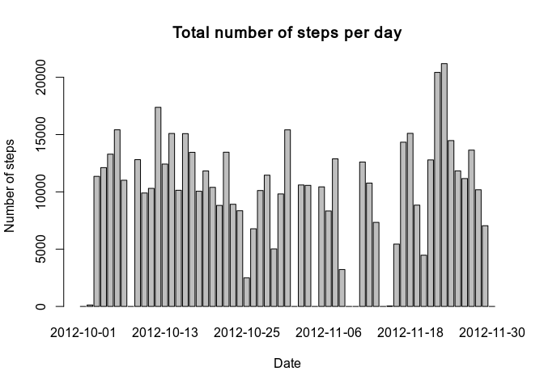
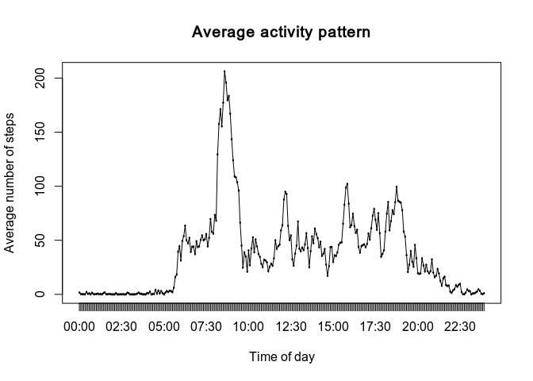
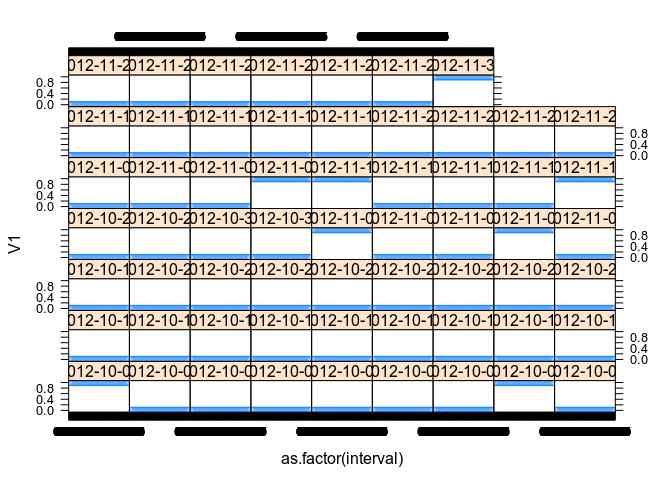
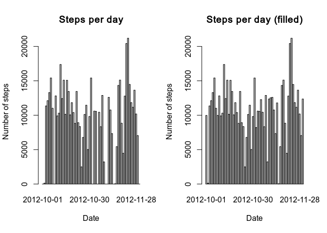
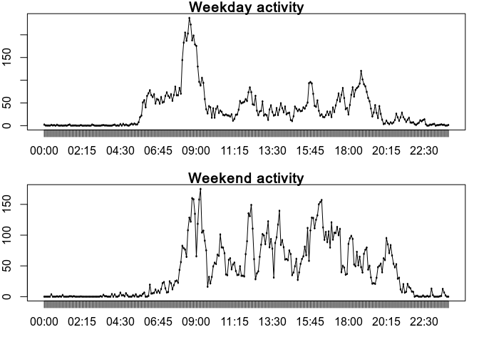

## Loading and preprocessing the data

```r
steps <- read.csv(
  unz('activity.zip', 'activity.csv'),
  colClasses = c('integer', 'Date', 'integer'),
  na.strings = 'NA'
)
```

The `date` column has already been converted to the appropriate format. It is still necessary to convert `interval` to a more standard format.


```r
interval <- sprintf('%04d', steps$interval)
steps$interval <- format(
  strptime(interval, format = '%H%M'),
  format = '%H:%M'
)
```

## What is mean total number of steps taken per day?

First, let's calculate daily metrics.


```r
library(dplyr)

steps_per_day <- steps %>% 
  group_by(date) %>%
  summarise(total = sum(steps, na.rm = TRUE),
            median = median(steps, na.rm = TRUE),
            mean = mean(steps, na.rm = TRUE))
```

Now let's plot the total number of steps for each day.


```r
barplot(steps_per_day$total, names.arg = steps_per_day$date)
title(
  main = 'Total number of steps per day',
  xlab = 'Date',
  ylab = 'Number of steps'
)
```

<!-- -->

And finally, report the mean and median steps.


```r
# The second column, where the total is, needs to be removed
# so we report only the mean and median
# n = Inf guarantees the entire tibble is printed
print(steps_per_day[-2], n = Inf)
```

```
## # A tibble: 61 x 3
##    date       median    mean
##    <date>      <dbl>   <dbl>
##  1 2012-10-01     NA NaN    
##  2 2012-10-02      0   0.438
##  3 2012-10-03      0  39.4  
##  4 2012-10-04      0  42.1  
##  5 2012-10-05      0  46.2  
##  6 2012-10-06      0  53.5  
##  7 2012-10-07      0  38.2  
##  8 2012-10-08     NA NaN    
##  9 2012-10-09      0  44.5  
## 10 2012-10-10      0  34.4  
## 11 2012-10-11      0  35.8  
## 12 2012-10-12      0  60.4  
## 13 2012-10-13      0  43.1  
## 14 2012-10-14      0  52.4  
## 15 2012-10-15      0  35.2  
## 16 2012-10-16      0  52.4  
## 17 2012-10-17      0  46.7  
## 18 2012-10-18      0  34.9  
## 19 2012-10-19      0  41.1  
## 20 2012-10-20      0  36.1  
## 21 2012-10-21      0  30.6  
## 22 2012-10-22      0  46.7  
## 23 2012-10-23      0  31.0  
## 24 2012-10-24      0  29.0  
## 25 2012-10-25      0   8.65 
## 26 2012-10-26      0  23.5  
## 27 2012-10-27      0  35.1  
## 28 2012-10-28      0  39.8  
## 29 2012-10-29      0  17.4  
## 30 2012-10-30      0  34.1  
## 31 2012-10-31      0  53.5  
## 32 2012-11-01     NA NaN    
## 33 2012-11-02      0  36.8  
## 34 2012-11-03      0  36.7  
## 35 2012-11-04     NA NaN    
## 36 2012-11-05      0  36.2  
## 37 2012-11-06      0  28.9  
## 38 2012-11-07      0  44.7  
## 39 2012-11-08      0  11.2  
## 40 2012-11-09     NA NaN    
## 41 2012-11-10     NA NaN    
## 42 2012-11-11      0  43.8  
## 43 2012-11-12      0  37.4  
## 44 2012-11-13      0  25.5  
## 45 2012-11-14     NA NaN    
## 46 2012-11-15      0   0.142
## 47 2012-11-16      0  18.9  
## 48 2012-11-17      0  49.8  
## 49 2012-11-18      0  52.5  
## 50 2012-11-19      0  30.7  
## 51 2012-11-20      0  15.5  
## 52 2012-11-21      0  44.4  
## 53 2012-11-22      0  70.9  
## 54 2012-11-23      0  73.6  
## 55 2012-11-24      0  50.3  
## 56 2012-11-25      0  41.1  
## 57 2012-11-26      0  38.8  
## 58 2012-11-27      0  47.4  
## 59 2012-11-28      0  35.4  
## 60 2012-11-29      0  24.5  
## 61 2012-11-30     NA NaN
```

## What is the average daily activity pattern?

Let's plot the average number of steps for each time interval.


```r
steps_per_interval <- steps %>% 
  group_by(interval) %>%
  summarise(average = mean(steps, na.rm = TRUE))

with(steps_per_interval,{
  plot(
     as.factor(interval), average,
     main = 'Average activity pattern',
     xlab = 'Time of day',
     ylab = 'Average number of steps'
  )
  points(as.factor(interval), average, type = 'l')
})
```

<!-- -->


```r
greatest_index <- which.max(steps_per_interval$average)
greatest_interval <- steps_per_interval$interval[greatest_index] 
```

The interval which has the greatest number of steps on average is 08:35.

## Imputing missing values

Let's first analyse the missing value distribution


```r
library(data.table)
library(lattice)

steps_DT <- as.data.table(steps)
missing_values <- steps_DT[, sum(is.na(steps)), by = .(date, interval)]

xyplot(V1 ~ as.factor(interval) | date, missing_values, alpha = 0.1)
```

<!-- -->

It isn't pretty, but we can see that NAs are only present when data for the entire day is missing.

We'll fill these values assuming activity remains relatively constant across weekdays in the same time interval. Thus the NAs will be replaced by the mean of the number of steps per weekday for that time interval through the entire dataset. We'll call the new dataset `steps_filled`


```r
steps_filled <- steps

na_means <- steps_DT[, mean(steps, na.rm = TRUE), by = .(weekdays(date), interval)]
na_indices <- which(is.na(steps$steps))

for(i in na_indices){
  wday <- weekdays(steps[[i, 2]])
  int <- steps[[i, 3]]
  impute_value <- subset(na_means,weekdays == wday & interval == int)$V1
  steps_filled[[i, 1]] <- impute_value
}
```

Let's check if it actually worked


```r
print(table(is.na(steps$steps)))
```

```
## 
## FALSE  TRUE 
## 15264  2304
```

```r
print(table(is.na(steps_filled$steps)))
```

```
## 
## FALSE 
## 17568
```

Now let's check again the metrics we calculated before imputing.
First up number of steps per day. For comparison's sake, we'll also redraw the previous plot.


```r
steps_filled_per_day <- steps_filled %>% 
  group_by(date) %>%
  summarise(total = sum(steps, na.rm = TRUE),
            median = median(steps, na.rm = TRUE),
            mean = mean(steps, na.rm = TRUE))

par(mfcol = c(1, 2))

barplot(steps_per_day$total, names.arg = steps_per_day$date)
title(
  main = 'Steps per day',
  xlab = 'Date',
  ylab = 'Number of steps'
)

barplot(steps_filled_per_day$total, names.arg = steps_per_day$date)
title(
  main = 'Steps per day (filled)',
  xlab = 'Date',
  ylab = 'Number of steps'
)
```

<!-- -->

Then mean and median.


```r
print(steps_per_day[-2], n = Inf)
```

```
## # A tibble: 61 x 3
##    date       median    mean
##    <date>      <dbl>   <dbl>
##  1 2012-10-01     NA NaN    
##  2 2012-10-02      0   0.438
##  3 2012-10-03      0  39.4  
##  4 2012-10-04      0  42.1  
##  5 2012-10-05      0  46.2  
##  6 2012-10-06      0  53.5  
##  7 2012-10-07      0  38.2  
##  8 2012-10-08     NA NaN    
##  9 2012-10-09      0  44.5  
## 10 2012-10-10      0  34.4  
## 11 2012-10-11      0  35.8  
## 12 2012-10-12      0  60.4  
## 13 2012-10-13      0  43.1  
## 14 2012-10-14      0  52.4  
## 15 2012-10-15      0  35.2  
## 16 2012-10-16      0  52.4  
## 17 2012-10-17      0  46.7  
## 18 2012-10-18      0  34.9  
## 19 2012-10-19      0  41.1  
## 20 2012-10-20      0  36.1  
## 21 2012-10-21      0  30.6  
## 22 2012-10-22      0  46.7  
## 23 2012-10-23      0  31.0  
## 24 2012-10-24      0  29.0  
## 25 2012-10-25      0   8.65 
## 26 2012-10-26      0  23.5  
## 27 2012-10-27      0  35.1  
## 28 2012-10-28      0  39.8  
## 29 2012-10-29      0  17.4  
## 30 2012-10-30      0  34.1  
## 31 2012-10-31      0  53.5  
## 32 2012-11-01     NA NaN    
## 33 2012-11-02      0  36.8  
## 34 2012-11-03      0  36.7  
## 35 2012-11-04     NA NaN    
## 36 2012-11-05      0  36.2  
## 37 2012-11-06      0  28.9  
## 38 2012-11-07      0  44.7  
## 39 2012-11-08      0  11.2  
## 40 2012-11-09     NA NaN    
## 41 2012-11-10     NA NaN    
## 42 2012-11-11      0  43.8  
## 43 2012-11-12      0  37.4  
## 44 2012-11-13      0  25.5  
## 45 2012-11-14     NA NaN    
## 46 2012-11-15      0   0.142
## 47 2012-11-16      0  18.9  
## 48 2012-11-17      0  49.8  
## 49 2012-11-18      0  52.5  
## 50 2012-11-19      0  30.7  
## 51 2012-11-20      0  15.5  
## 52 2012-11-21      0  44.4  
## 53 2012-11-22      0  70.9  
## 54 2012-11-23      0  73.6  
## 55 2012-11-24      0  50.3  
## 56 2012-11-25      0  41.1  
## 57 2012-11-26      0  38.8  
## 58 2012-11-27      0  47.4  
## 59 2012-11-28      0  35.4  
## 60 2012-11-29      0  24.5  
## 61 2012-11-30     NA NaN
```

As expected, the daily number of steps increased only for the days which had no reported data, since all missing values were then. From the plot above, it's clear that imputing made changes particularly to the final days of data collection.

Mean and median weren't affected as much overall for the same reasons described above.

## Are there differences in activity patterns between weekdays and weekends?

Let's begin by creating a factor that classifies dates as weekdays or weekends in the dataset.


```r
day_type <- as.factor(
  format(steps$date, '%w') %in% c('0', '6')
)
levels(day_type) <- c('weekday', 'weekend')
```

Now let's plot the average number of steps for each time interval, separating weekdays from weekends. We'll use the dataset with no missing values we just created.


```r
weekday_means <- steps_filled %>%
  filter(day_type == 'weekday') %>%
  group_by(interval) %>%
  summarise(mean = mean(steps))
weekend_means <- steps_filled %>%
  filter(day_type == 'weekend') %>%
  group_by(interval) %>%
  summarise(mean = mean(steps))

par(mfrow = c(2, 1), mar = c(3, 2, 1, 1))

with(weekday_means, {
  plot(
    as.factor(interval), mean,
    main = 'Weekday activity',
  )
  points(as.factor(interval), mean, type = 'l')
})
with(weekend_means, {
  plot(
    as.factor(interval), mean,
    main = 'Weekend activity',
  )
  points(as.factor(interval), mean, type = 'l')
})
```

<!-- -->

